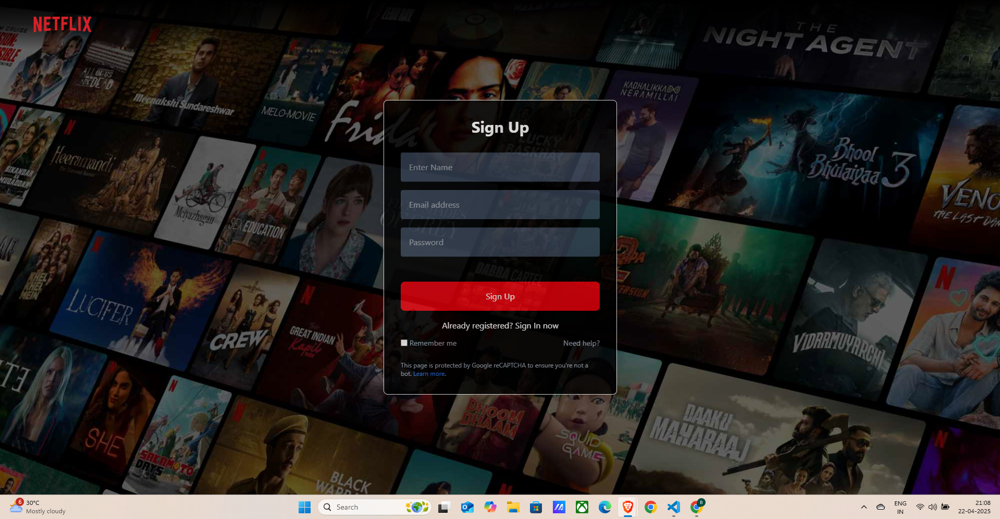
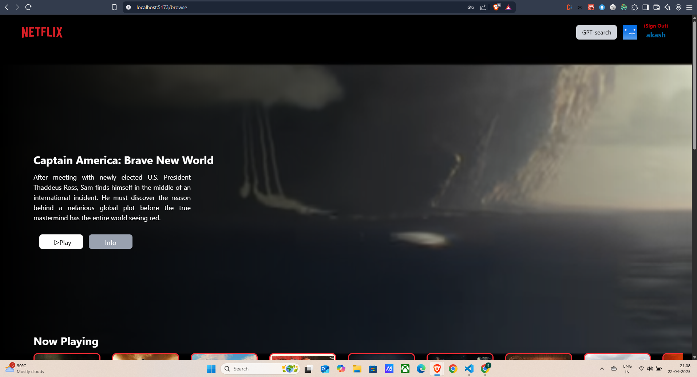
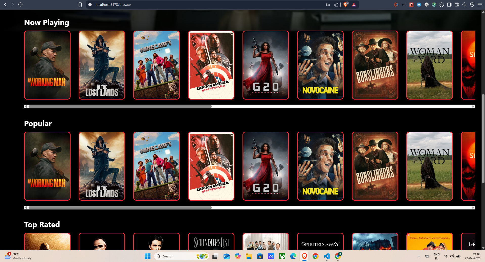
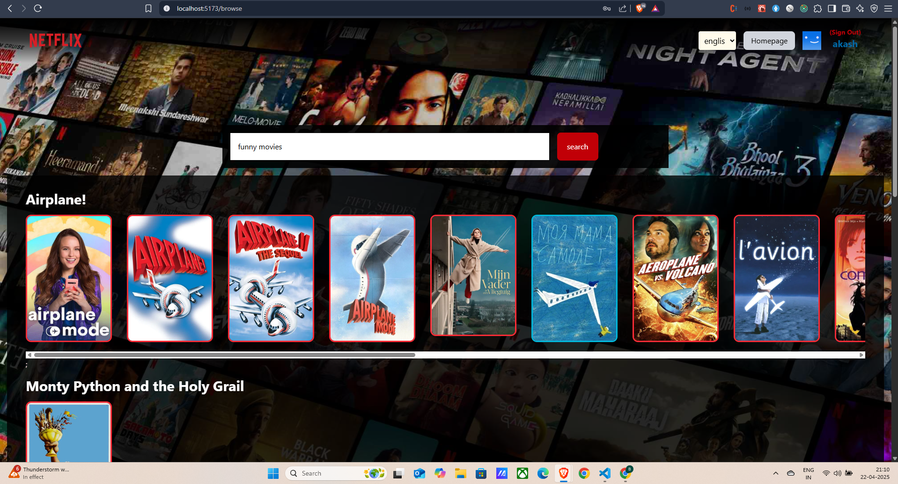

# 🎬 Netflix-GPT

> Your AI-powered Netflix clone that recommends movies using GPT & TMDB, built with **React**, **Redux**, **Firebase**, and **TailwindCSS**.

---

## 🔧 Tech Stack

- ⚛️ React
- 🎨 Tailwind CSS
- ⚙️ Redux Toolkit
- 🔥 Firebase Authentication
- 🎥 TMDB Movie API
- 🤖 GPT-based Search
- 🌐 Fully Responsive

---

## 🚀 What I Built

### 📦 Project Setup

- ✅ Create React App
- 🎨 Tailwind CSS Configuration
- 🧭 React Router for Navigation

### 🔐 Authentication

- 📝 Login / Sign Up Form
- 🔍 Form Validation (with `useRef`)
- 🔥 Firebase Setup
- 👤 User Creation + Profile Update
- 🔐 Secure Route Guards

### 🧠 State Management

- ⚙️ Created `Redux Store` with `userSlice`, `moviesSlice`, `gptSlice`
- ♻️ Memoization for performance
- 🧼 Handled onAuthStateChanged cleanup

### 🎞️ Movie Experience

- 🎬 Fetch Now Playing Movies (TMDB)
- 🎥 Embedded YouTube Trailer (Autoplay + Mute)
- 🧩 MovieList & MovieCard Components
- 🖼️ TMDB Image CDN usage
- 🪄 Tailwind Styling for stunning UI

### 📊 Movie Categories

- ✅ useNowPlayingMovies
- ✅ usePopularMovies
- ✅ useTopRatedMovies
- ✅ useUpcomingMovies

### 🔍 GPT Movie Search

- 🧠 GPT-powered movie search engine
- 🌐 Multi-language support
- 🔄 Integrated TMDB with GPT results
- 🔁 Reused UI Components for GPT suggestions

### 🔐 .env Setup

- Added `.env` file to store API keys
- ✅ Added `.env` to `.gitignore` for GitHub safety

---

## 🎯 Key Features

### 🔐 Authentication
- Sign Up / Sign In
- Profile Update (Name & Picture)
- Redirects for protected routes

### 🎥 Browse Page
- Header with User Avatar
- Main Movie Banner
- Movie Trailer Background
- Horizontal Scrollable Movie Lists:
  - Now Playing
  - Popular
  - Top Rated
  - Upcoming

### 🧠 GPT Movie Search
- Search Movies by Description
- GPT Suggestion + TMDB Fetch
- Multilingual Search Support
- Seamless UI Transition with Redux

---

## 📂 Folder Structure Highlights
src/ │ ├── components/ │ ├── Header.jsx │ ├── MovieCard.jsx │ └── MovieList.jsx │ ├── hooks/ │ └── useNowPlayingMovies.js │ └── usePopularMovies.js │ ├── reduxStore/ │ ├── userSlice.js │ ├── moviesSlice.js │ └── gptSlice.js │ ├── pages/ │ ├── Browse.jsx │ ├── Homepage.jsx │ └── GPTSearch.jsx │ └── utils/ ├── firebase.js └── constant.js


---

## 💻 Responsive Design

- ✅ Mobile-first layout
- ✅ Optimized for tablets and desktops
- ✅ Touch-friendly buttons and smooth scroll

---

## 📷 Screenshots

_Add your screenshots here:_

```md
.png)





